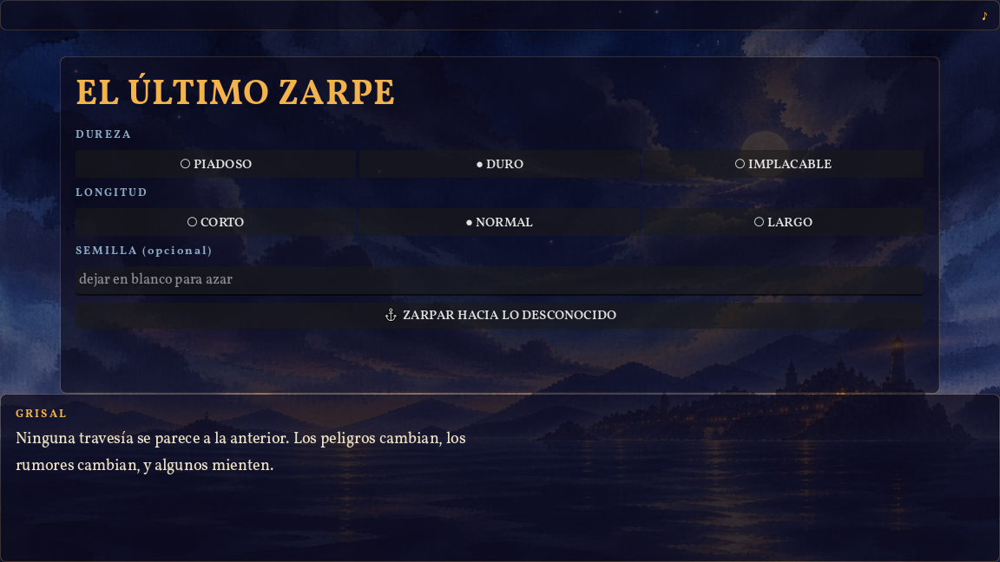
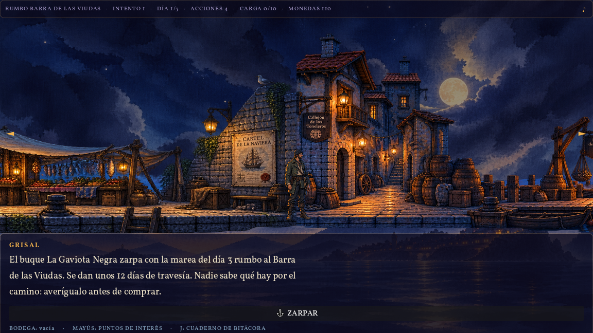
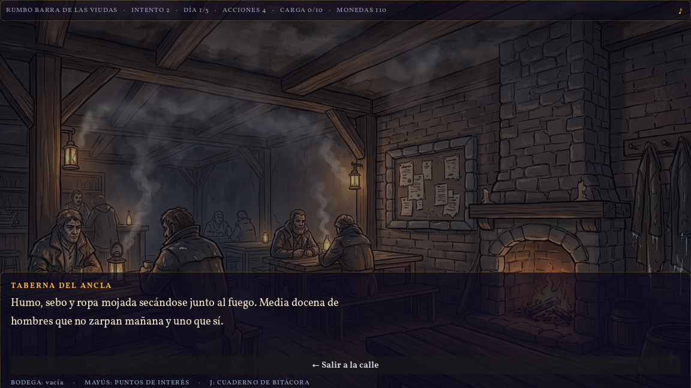
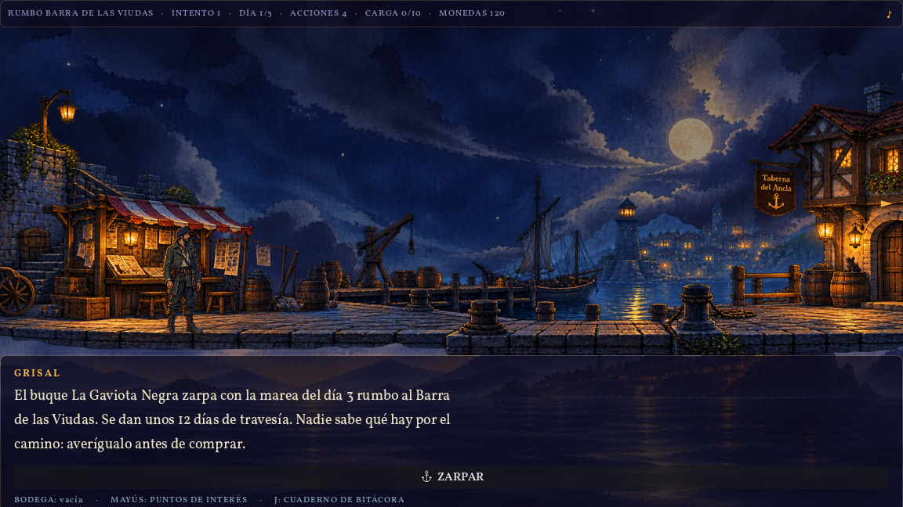
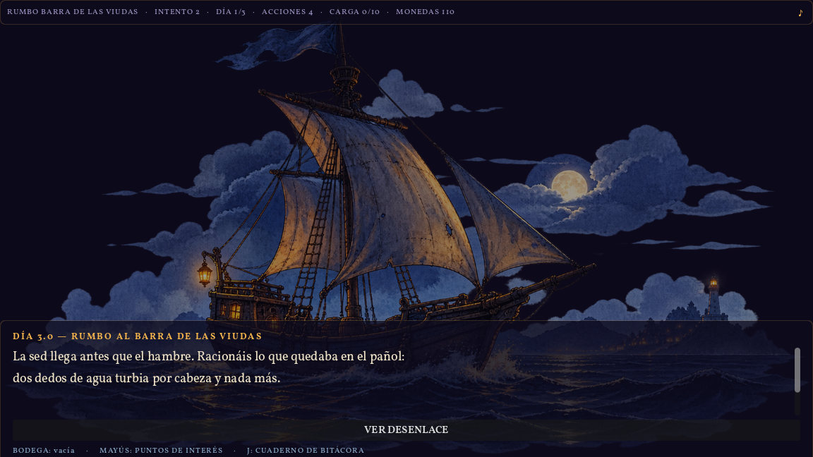

# El Último Zarpe

> Un roguelike de preparación donde lo único que sobrevive al bucle es lo que has entendido.

| | |
|---|---|
| **Tipo** | Side project — juego propio |
| **Rol** | Diseño de juego, desarrollo y dirección de arte |
| **Timeline** | Julio 2026 – en curso |
| **Stack** | Godot 4.7 · GDScript · JSON como capa de reglas · prototipo HTML/SVG/JS como oráculo · ilustración generada + composición manual |

---

## 1. Contexto

El roguelike moderno enseña al jugador a memorizar builds. Repites hasta que la
combinación correcta se te queda grabada, y la muerte se convierte en un peaje
administrativo: pierdes una partida, ganas monedas permanentes, vuelves más
fuerte. La dificultad no la resuelve el jugador; la erosiona el desbloqueo.

Quería un juego que hiciera lo contrario: **que la única cosa que se acumulara
entre partidas fuera comprensión**. Sin monedas persistentes, sin árbol de
mejoras, sin "meta-progresión". Si el segundo intento va mejor, tiene que ser
porque el jugador sabe algo que antes no sabía.

Eso obliga a una premisa muy concreta, y de ahí sale *El Último Zarpe*: un
puerto llamado Grisal, unos días contados, un barco que zarpa con o sin ti, y
una travesía cuyos peligros son desconocidos. Preparas el viaje con dinero
limitado, información contradictoria y una bodega que no da para todo.
Normalmente mueres. Lo que aprendes al morir es todo lo que te llevas.

<figure>
  
  <figcaption>Pantalla de inicio. Dureza, longitud y semilla. "Ninguna travesía se parece a la anterior. Los peligros cambian, los rumores cambian, y algunos mienten."</figcaption>
</figure>

---

## 2. Proceso

### El problema real no era el bucle, era la injusticia

Un juego que mata al jugador constantemente tiene un margen de error muy
estrecho. Si una muerte se siente arbitraria, el jugador no aprende: se va. Así
que la primera decisión de diseño no fue de contenido sino de contrato:

> **Nunca mentir al jugador sobre las reglas; sí sobre los hechos.**

Las pistas pueden ser falsas, los personajes pueden tener intereses propios y la
gente miente en la taberna. Pero el sistema es justo. Y "justo" aquí no es una
promesa de intenciones: **cada viaje generado se demuestra soluble antes de
dejarte empezar**. Un verificador prueba por fuerza bruta que existe al menos
una combinación de compras que sobrevive, con margen económico. Si no la
encuentra, ese viaje no llega al jugador. La dificultad nunca es una tirada
injusta; es información que no fuiste a buscar.

### Reintentar es el mismo puzzle, no uno nuevo

La decisión más contraintuitiva del proyecto: **"volver a Grisal" repite la
misma semilla a propósito**. La tentación de un roguelike es dar una partida
nueva tras cada muerte. Pero eso convierte el fracaso en ruido: si el próximo
viaje es otro, lo que aprendiste sobre este no vale nada.

Repitiendo la semilla, el segundo intento es el mismo enemigo con más luz. El
jugador vuelve al puerto sabiendo que el agua se acaba el día 3, y esta vez
gasta sus preguntas en otra cosa. Ese es el juego.

### El prototipo primero, en HTML

Antes de tocar Godot construí el juego entero como una página HTML con SVG y JS
—jugable de principio a fin— para poder discutir el diseño jugándolo en vez de
imaginándolo. Cuando la mecánica quedó clara, ese prototipo pasó a ser algo más
útil que documentación: **la especificación ejecutable del port**. El motor de
Godot no se consideró correcto hasta que generaba exactamente el mismo viaje que
el prototipo para la misma semilla, en 405 de 405 combinaciones de semilla ×
dificultad × longitud.

### Se midió que el juego aburría, y se arregló con números

Tras el port, una medición incómoda: en modo largo solo existían **6 puzzles
posibles**. Tres parámetros de dificultad no hacían nada en absoluto. El juego
que en teoría era infinitamente rejugable era, en la práctica, memorizable en una
tarde.

La respuesta fue ampliar el repertorio (de 6 a 12 peligros, de 13 a 18 objetos —
de 6 puzzles posibles a 792 en modo largo) y, sobre todo, **sacar las reglas del
código y meterlas en datos**. Hoy la dificultad vive en un JSON: cuánto tapa un
objeto de calma, cuántas pistas falsas hay, cuál es el margen económico mínimo.
Se tunea entre partidas de playtest sin recompilar.

### El mapa del puerto también es una variable

El puerto tiene once lugares. **No abren todos cada partida**: la misma semilla
que genera el viaje sortea cuáles están abiertos hoy. La ruta óptima deja de ser
memorizable — tienes que decidir a quién preguntar con lo que hay abierto.

Dos salvaguardas evitan que la rotación degenere en frustración. Hay un **suelo
de información**: si el sorteo deja el puerto demasiado pobre, se abren lugares
extra hasta garantizar un mínimo de fuentes. Y una regla más dura, aprendida a
base de romperla: **lo que apaga una mecánica no rota**. Al principio el callejón
—donde vive el único informador capaz de señalar que una pista es falsa— entraba
en el sorteo. Medido: en ~44 % de las partidas el jugador perdía la capacidad de
detectar mentiras sin que nada se lo dijera. Exactamente el tipo de dificultad
que el juego no busca, porque no se puede aprender de ella. El callejón, el
mercado y el muelle abren siempre. Costó variedad (de 126 mapas posibles a 56) y
valió la pena.

---

## 3. La solución

### El puerto: un panorama, no un menú

Grisal es un panorama lateral con parallax por el que caminas. Los sitios donde
puedes preguntar son objetos del mundo dibujado —un cartel, una puerta, una
pizarra—, no entradas de una lista. Los menús reales se reservan para los dos
sitios donde el jugador espera un menú: el mercado y la contrata de tripulación.

<figure>
  
  <figcaption>El puerto de Grisal. El HUD dice lo único que importa: rumbo, intento, día, acciones, carga y monedas.</figcaption>
</figure>

### Preguntar cuesta; recordar es gratis

El recurso escaso no es el dinero: son **las acciones del día**. Cada fuente que
consultas gasta una, y a veces también monedas. Cuando se agotan, el día avanza y
el barco está un día más cerca de zarpar. Por eso todo lo que cuesta acciones es
una decisión de verdad, y lo que solo cuesta dinero casi nunca lo es.

El reverso de esa regla: **consultar lo que ya sabes no cuesta nada**. El
cuaderno de bitácora, los apuntes y la bodega se miran gratis, siempre. El
jugador no debe pagar por recordar.

<figure>
  
  <figcaption>La taberna. Rumores baratos y poco fiables: media docena de hombres que no zarpan mañana y uno que sí.</figcaption>
</figure>

### Ninguna fuente basta

Las pistas vienen de gente con motivos distintos y fiabilidad distinta: el
periódico está sesgado, la taberna exagera, el maestro de ribera es caro pero
técnico, los exvotos de la capilla cuentan miedos y no observaciones, el
registro del hospital sí sabe qué mata a bordo. Algunas pistas son directamente
falsas. La regla de diseño es que **ninguna fuente sola da la verdad**: hay que
cruzar dos como mínimo antes de gastarse el dinero.

<figure>
  
  <figcaption>La lonja: rumor de gremio en el corrillo, dato oficial en la pizarra de la subasta. Dos voces con fiabilidad distinta en el mismo sitio.</figcaption>
</figure>

### La travesía se resuelve de una pasada

No hay barra de vida. La travesía se juega sola, encadenando lo que preparaste
—o lo que no— en una cascada de fallos: la sed llega antes que el hambre, racionas
agua turbia, la tripulación se tensa, y para cuando llega la bruma ya no quedan
manos sanas. Lo que llevas es lo que tienes. Cuando termina, la bitácora anota
qué te mató, en qué día y con qué en la bodega.

<figure>
  
  <figcaption>Día 3 de travesía. "La sed llega antes que el hambre. Racionáis lo que quedaba en el pañol."</figcaption>
</figure>

---

## 4. Resultados

El juego es **jugable de principio a fin** y se distribuye como ejecutable
autocontenido de Windows, verificado en un directorio limpio.

Sobre lo que se puede medir hoy — todo es de sistema, no de jugadores:

| | |
|---|---|
| **405/405** | combinaciones con paridad exacta contra el prototipo, en dos oráculos independientes |
| **792** | puzzles posibles en modo largo (eran 6) |
| **56** | mapas de puerto distintos por rotación de lugares |
| **11** | lugares en el puerto, 21 ranuras de pista, 18 objetos comprables |
| **0,32–0,53** | peligros sin ninguna pista honesta, por partida — mejor que el 0,49–0,86 de la versión anterior |

**Aún no hay jugadores.** Ni playtests externos, ni métricas de retención, ni
tienda, ni fecha. Cualquier cifra de arriba habla de la solidez del sistema, no
de que a alguien le haya gustado. Ese es el siguiente paso, no un resultado ya
conseguido.

---

## 5. Aprendizajes

**Medir la variedad antes de creértela.** El juego "infinitamente rejugable"
tenía seis puzzles. No lo detectó una intuición de diseño: lo detectó contar. Si
un sistema generativo no se instrumenta, se asume que funciona porque es
generativo.

**La dificultad tiene que poder aprenderse.** El caso del callejón es el que más
me enseñó: no era un bug ni un desequilibrio de números, era una mecánica que se
apagaba en silencio en casi la mitad de las partidas. El jugador habría notado
que iba peor sin poder saber por qué. De ahí salió la regla que ahora gobierna
cualquier ampliación: lo que rota son voces, nunca mecánicas.

**Un prototipo jugable vale más como oráculo que como documento.** Escribir el
juego dos veces —primero en HTML para jugarlo, después en el motor— parece
duplicar trabajo. Lo que dio fue una definición de "correcto" que no admite
opinión: mismo resultado para la misma semilla, o el port está mal.

**Lo que falta, y lo sé.** Los días de preparación siguen siendo decorativos: no
filtran qué peligros pueden salir, y hacerlo importar es el cambio con más
recorrido pendiente. El agua es obligatoria siempre, así que una de las
decisiones de compra no es tal decisión. Y casi nunca queda un peligro sin
ninguna pista honesta en el mapa, lo que significa que el jugador rara vez tiene
que apostar bajo incertidumbre — que es justo lo que daría sentido pleno a la
bitácora entre bucles.

---

## Ver el proyecto

*El Último Zarpe* está en desarrollo. Build de Windows funcional; sin tienda ni
fecha todavía.

<!-- CTA: añadir aquí el enlace a Steam / itch.io / vídeo cuando exista -->

**RBT Studio** — Experience Engineering
[ricardboixeda@gmail.com](mailto:ricardboixeda@gmail.com)
