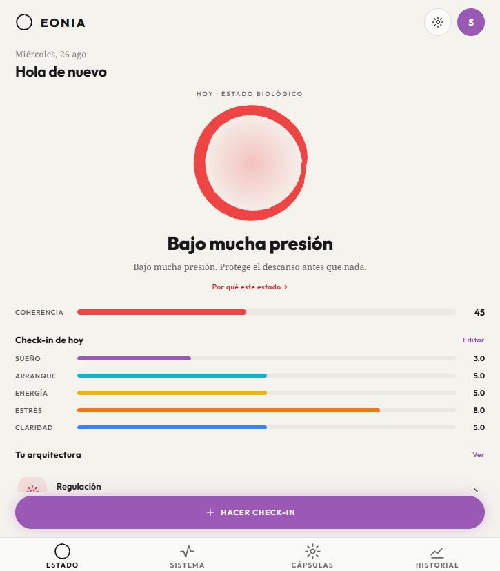
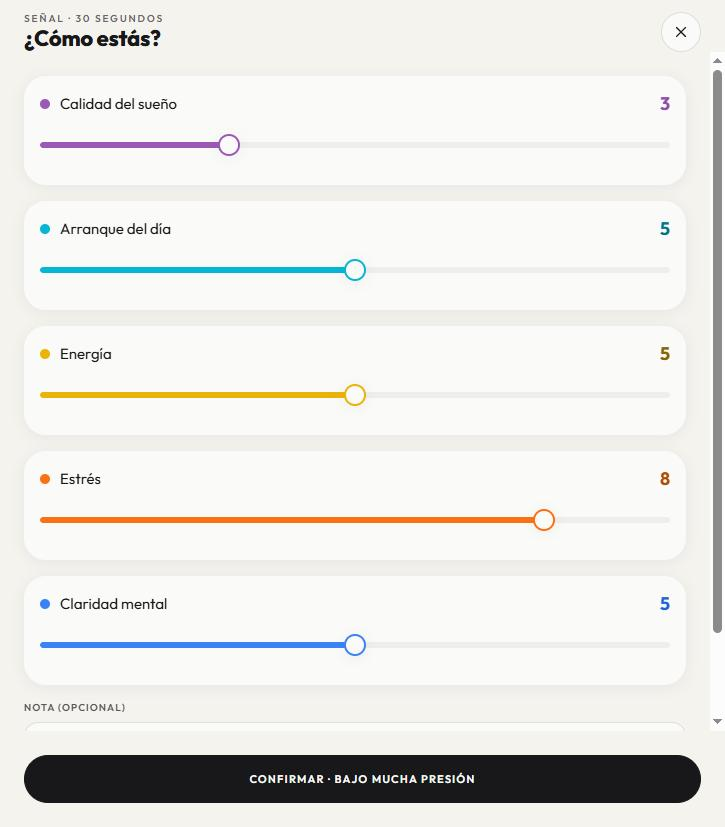
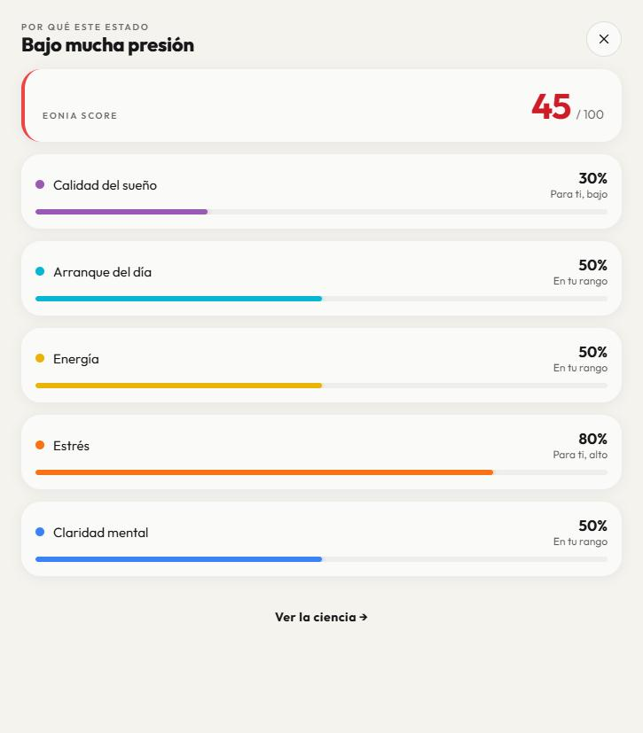
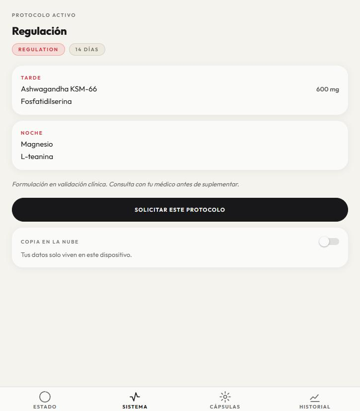
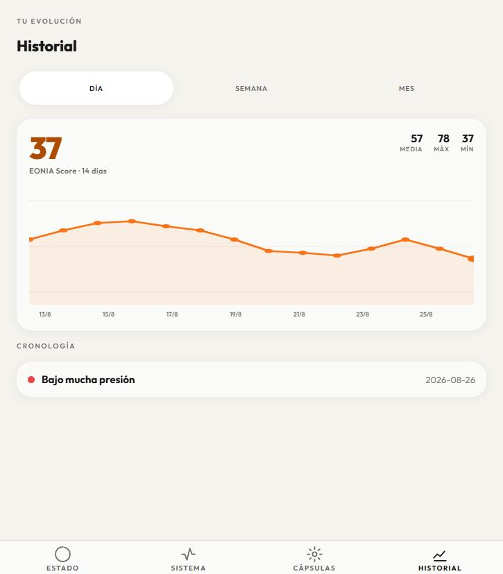
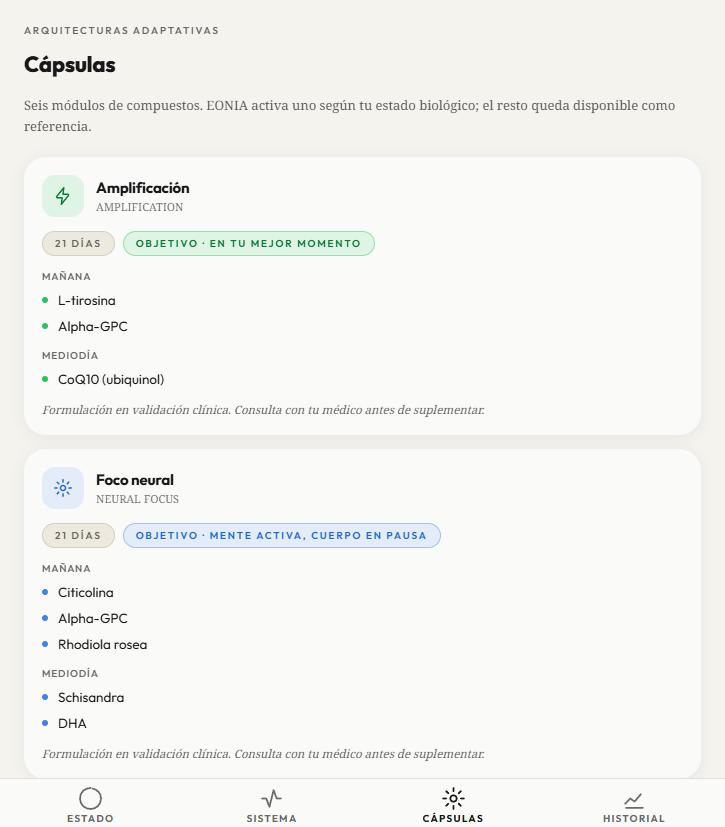

# EONIA — La capa de decisión biológica

> Una app que no te recomienda: **decide**. Un check-in de 30 segundos se convierte en un estado
> biológico calculado y en una arquitectura de cápsulas adaptada a ese estado, todo en el dispositivo.

| | |
|---|---|
| **Proyecto** | EONIA — *biological decision layer* |
| **Tipo** | Producto propio · RBT Studio |
| **Rol** | Producto, diseño de sistema y desarrollo full-stack + IA (autor único) |
| **Timeline** | Junio 2026 → en curso (MVP v1.0 + incremento servidor v1.5 construidos) |
| **Stack** | TypeScript · React Native / Expo Router · React Native Skia + Reanimated · NestJS · PostgreSQL (pgvector) · Redis · Clerk · LangGraph + Claude · React + Vite · Docker · Render · EAS |

*Pantalla STATE — build web del MVP con datos de demostración.*

---

## 1. Contexto — el hueco está en la decisión, no en el dato

El usuario de alto rendimiento de 2026 tiene más datos biológicos que ninguna generación anterior:
HRV del wearable, analíticas, podcasts de longevidad. Y sigue tomando los mismos suplementos cada
mañana, dé igual cómo esté hoy.

El mercado ha resuelto bien dos extremos y ha dejado el centro vacío:

- **Medición** — Oura, WHOOP, Apple Health. Excelentes midiendo.
- **Intervención** — suplementación basada en evidencia. Excelente en formulación.
- **Decisión** — vacío.

Ese vacío es el producto. Y la diferencia es estructural, no incremental: **un sistema que
recomienda traslada la carga cognitiva al usuario; un sistema que decide la absorbe.** El usuario de
EONIA no necesita entender el eje HPA para beneficiarse de él.

De ahí la tesis que gobierna todas las decisiones posteriores: **comprensión por encima de dato**.
Cada pantalla responde a una sola pregunta — *¿qué tengo que hacer ahora mismo para estar bien?* —
sin gráficas y sin jerga por delante.

## 2. Proceso — especificar antes de programar, y decidir por escrito

El proyecto arrancó con un set documental completo (SPEC · ARCHITECTURE · SCAFFOLD · DESIGN ·
HANDOFF) antes de la primera línea de producto, y cada decisión estructural quedó fijada como un ADR
con su alternativa descartada. No es burocracia: en un producto que toca salud, la trazabilidad de
*por qué* el sistema decide lo que decide es parte del producto.

Las decisiones que definieron todo lo demás:

**ADR-01 · El motor de decisión es puro y determinista.**
`@eonia/engine` no tiene I/O, ni React, ni red, ni modelo de lenguaje. Entra un check-in, sale un
estado y una arquitectura. Es el único sitio donde se decide. Consecuencia deliberada: el mismo
paquete corre **en el dispositivo y en el servidor** y produce exactamente el mismo veredicto — lo
que hace que el modo offline no sea una versión degradada, sino el mismo sistema.

**ADR-02 · Local-first, sin backend en el MVP.**
El motor y los datos viven en el dispositivo (SQLite en nativo, localStorage en web). La nube llegó
después y llegó **opt-in**: sincronización aditiva, nunca una dependencia del bucle diario. La app
es plenamente funcional sin servidor.

**ADR-03 · El Orb es una entidad, no una gráfica.**
La visualización central (Skia + Reanimated, trazo de pincel *sumi-e*) tiene que comunicar el estado
biológico **pre-cognitivamente**: en menos de un segundo, sin leer ni interpretar. Un donut chart
habría sido más barato y habría fallado en el único requisito que importaba.

**ADR-04 · Las tres capas de información son un límite arquitectónico.**
Capa 1: qué hacer. Capa 2: por qué. Capa 3: el mecanismo fisiológico. La profundidad está
disponible, nunca impuesta — y se impone como frontera en el código, no como convención de diseño.

**ADR-06 · Reconciliar el backend B2B2C heredado con un producto B2C.**
El repositorio arrastraba una plataforma multitenant de una etapa anterior del proyecto. En vez de
tirarla o dejar que arrastrase al producto hacia B2B, el ADR fijó la relación: el dispositivo es
autoritativo, el servidor es una capa aditiva (backup, sync, admin, fulfillment futuro) y la
superficie multitenant queda dormida. Una decisión de producto escrita como decisión de
arquitectura.

**El reto más interesante: dónde entra la IA.**
La capa narrativa (`@eonia/narrative`) genera el informe personalizado con LangGraph y Claude, pero
bajo una restricción dura heredada de ADR-01: **el motor decide, el LLM solo explica.** El nodo de
preparación es código puro — normalización, aritmética de tendencias, resolución de etiquetas — y el
modelo recibe un contexto *grounded* del que no puede salir: no deriva un estado, ni una
arquitectura, ni un número propio. Tres especialistas analizan en paralelo (tendencia, arquitectura,
adherencia), un nodo sintetiza y una **puerta de seguridad** decide entre entregar o escalar. Una
alucinación en el nodo de normalización se habría propagado a todas las ramas; por eso ese nodo no
es una llamada al modelo.

<!-- ESQUEMA: grafo de la capa narrativa — prepare → (trend | architecture | adherence) → synthesize → gate_safety → deliver / escalate -->

**El catálogo clínico tenía que salir del código.**
Las fórmulas vivían como constantes en el motor, lo que implicaba que actualizar un protocolo era un
despliegue. Se movieron a base de datos y se construyó una consola de back-office (`apps/admin`,
React + Vite) con tres roles no jerárquicos: *admin* (usuarios, auditoría), *specialist* (catálogo de
compuestos, fichas RAG) y *provider* (peticiones, envíos). Editar el catálogo **invalida la firma
clínica** y sube la versión; la clave de caché de los informes incluye esa versión. Es la única vía
por la que un farmacéutico —no un commit— puede firmar un protocolo.

**Un incidente que merece estar en el case study.**
Con la beta ya en manos de testers, todos los usuarios quedaron bloqueados tras verificar su email.
La causa: `force_organization_selection` activado en el proveedor de identidad. Cada sesión recibía
una tarea de "elegir organización" que un usuario B2C nunca puede satisfacer, la sesión se quedaba
`pending`, el cliente la contaba igualmente y el modo de sesión única rechazaba cualquier login
nuevo con `session_exists`. Se arregló en dos frentes: la configuración (apagarlo) **y** el cliente
(recuperación explícita de sesiones inutilizables), porque una app en producción no puede depender
de que la consola de un tercero esté bien configurada.

## 3. Solución — qué se construyó

Monorepo npm con cinco workspaces, cada uno con una frontera clara:

| Workspace | Qué es |
|---|---|
| `packages/engine` | Núcleo de decisión puro: scoring ponderado, baseline individual, clasificación en 6 estados, histéresis de transición de 3 días, detección de arquitecturas bloqueadas y dosificación circadiana por compuesto. 35 tests. |
| `apps/mobile` | App Expo Router: STATE · SYSTEM · CAPSULES · HISTORY, con el check-in como modal. Persistencia local, sync opcional, login opcional, ES/EN. |
| `apps/backend` | API NestJS: sync en la nube, informes narrativos, API de la consola, harness de personas sintéticas y la superficie multitenant dormida. |
| `apps/admin` | Consola de back-office React + Vite servida por el backend, con las tres superficies de rol. |
| `packages/narrative` | Capa narrativa LangGraph + Claude, *grounded* contra la salida del motor. |

**El bucle, en concreto**

1. **Señal** — check-in diario de 5 dimensiones (sueño · arranque · energía · estrés · claridad) en ~30 segundos.
2. **Decisión** — EONIA Score, baseline personal, uno de 6 estados biológicos (`PEAK_PERFORMANCE`, `SYSTEMIC_BASELINE`, `HPA_OVERLOAD`, `ALLOSTATIC_ADAPTATION`, `PARASYMPATHETIC_DEFICIT`, `COGNITIVE_PRIORITY`).
3. **Ejecución** — una de 6 arquitecturas de cápsulas (`AMPLIFICATION`, `NEURAL_FOCUS`, `DEEP_RECOVERY`, `REGULATION`, `ANTI_INFLAMMATORY`, `BASELINE`), con ventanas circadianas por compuesto.
4. **Cierre del bucle** — el siguiente check-in refina la decisión siguiente. La arquitectura solo cambia tras 3 días coherentes seguidos: histéresis deliberada contra la oscilación por ruido.

*Señal — el check-in de 5 dimensiones. El botón ya anticipa el veredicto antes de confirmar.*

*Capa 2 — «por qué este estado»: cada dimensión contra tu baseline, no contra una media poblacional.*

*Ejecución — protocolo activo con ventanas circadianas por compuesto, y el sync en la nube apagado por defecto.*

*Historial — tendencia del EONIA Score (datos de demostración).*

*Catálogo — las seis arquitecturas; EONIA activa una, el resto queda como referencia.*

<!-- CAPTURA PENDIENTE: consola de back-office — vista de catálogo de compuestos (rol specialist). Requiere backend + sesión de staff. -->

**Decisiones de producto que se sostuvieron**

- **Sin gamificación.** Ni rachas, ni medallas, ni "buen trabajo". El tono es el de un instrumento de precisión: frío, exacto, sin adorno. Es una postura, no un descuido.
- **Sin gráficas por delante.** Los números crudos nunca son la superficie primaria.
- **Sistema visual propio** — papel y tinta cálidos, tipografía display geométrica, y un espectro de 7 acentos cromáticos donde cada dimensión posee su tono en orbe, porcentaje y barra.

## 4. Resultados

Sin métricas de usuarios todavía — la beta es cerrada y no se han publicado cifras. Lo que sí es
verificable:

- **MVP v1.0 completo y desplegado**: backend dockerizado en Render vía Blueprint (Postgres + API, migraciones en boot) y APK Android distribuida a testers vía EAS.
- **Incremento de servidor v1.5 en producción** (ADR-06): sync opcional autenticado, informes narrativos, consola de back-office con control de acceso por rol.
- **35 tests sobre el núcleo de decisión**, incluyendo un test de integración multi-día que verifica la histéresis de transición — la parte del sistema en la que un fallo silencioso sería más caro.
- **Catálogo clínico editable con firma**: los protocolos ya no son código, y la firma clínica es un estado del dato que solo un profesional puede establecer.
- **46 commits** desde el kickoff, con el set SDD mantenido en sincronía con el código en cada incremento.

## 5. Aprendizajes

- **El ADR que más valor dio no fue técnico.** ADR-06 no resolvió un problema de código: resolvió si el producto era B2C o B2B2C. Escribirlo como decisión de arquitectura fue lo que impidió que el backend heredado arrastrase el producto hacia donde no quería ir.
- **Poner el LLM en el sitio equivocado es fácil y caro.** La tentación era dejar que el modelo interpretase los datos. Restringirlo a *explicar* una decisión ya tomada por código verificable es lo que hace que el sistema sea auditable — y lo que permite que el modo offline no pierda nada esencial.
- **Todo lo que un profesional deba poder cambiar no puede vivir en el código.** Si actualizar un protocolo exige un despliegue, el experto de dominio queda fuera del producto. Mover el catálogo a base de datos con firma y versionado fue lo que convirtió una app en un sistema operable.
- **La configuración de un tercero es superficie de producción.** Un flag mal puesto en el proveedor de identidad bloqueó al 100% de los testers. Desde ese incidente, el cliente asume que la configuración remota puede estar mal y se recupera sola.
- **Qué haría distinto**: instrumentar el bucle de onboarding con analítica de producto desde el día uno. Los tests cubren el motor; no cubren la pregunta de si la gente vuelve al día siguiente.

## 6. Siguientes pasos

v1.5 abre a señales objetivas (Oura, WHOOP, Apple HealthKit) como fuente de señal enchufable; v2.0
lleva la primera arquitectura física (REGULATION) a fulfillment real y añade panel de prescriptor;
v3.0 apunta a formulación generativa personalizada.

---

**EONIA** · producto propio de RBT Studio
Demo y beta bajo petición · [ricardboixeda@gmail.com](mailto:ricardboixeda@gmail.com)
