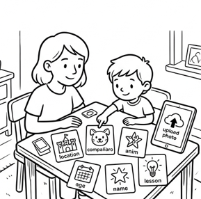
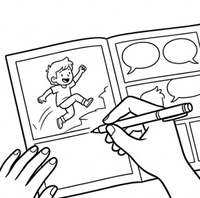
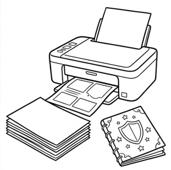
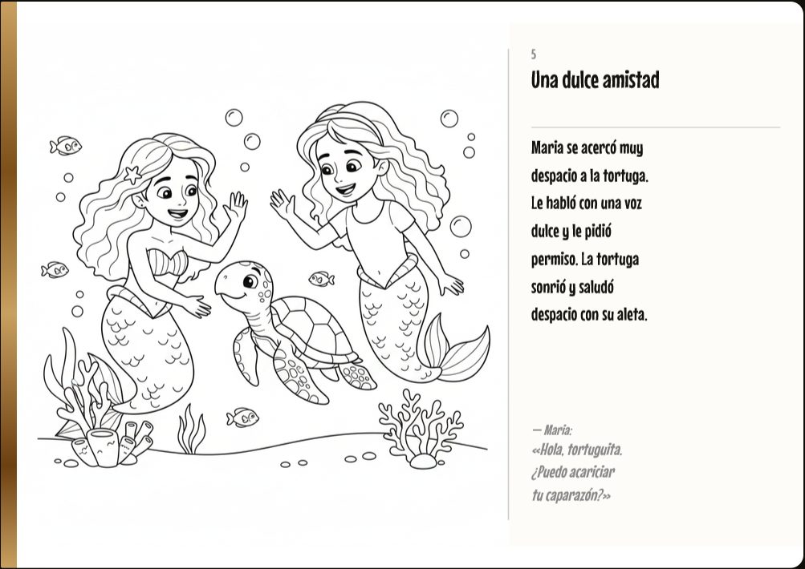
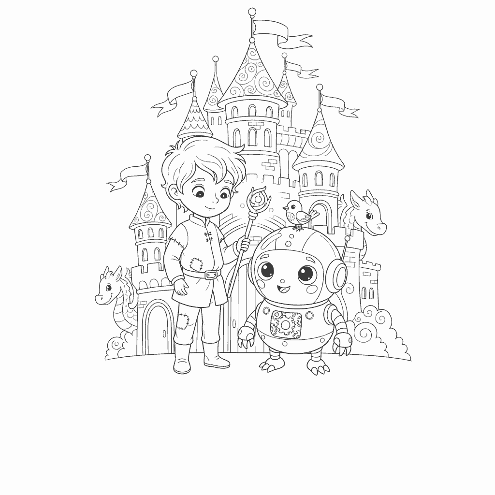
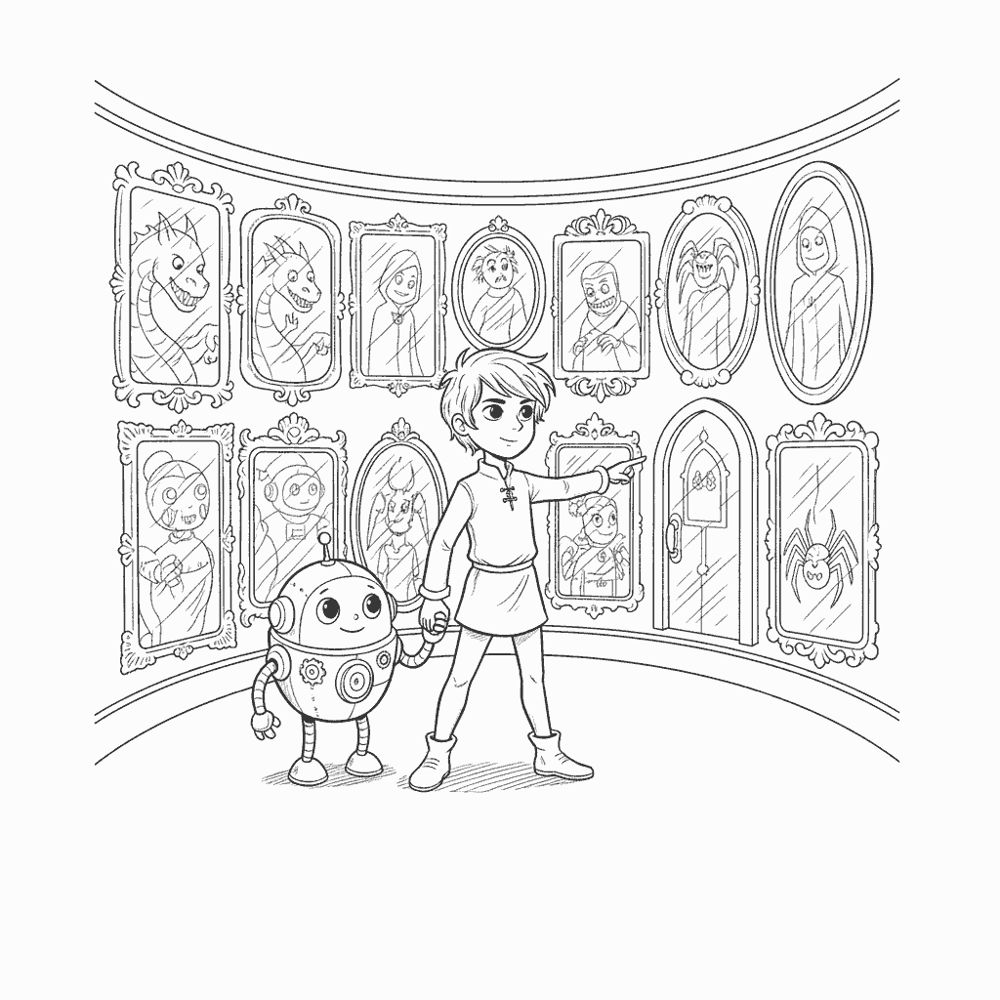

# StoryPrints

**Un cuento infantil personalizado, ilustrado por IA y listo para imprimir y colorear.**

| | |
|---|---|
| **Tipo** | Side project / producto propio — RBT Studio |
| **Rol** | Producto, diseño y desarrollo full stack (una sola persona) |
| **Timeline** | Marzo 2026 – en curso |
| **Stack** | Next.js 15 (App Router) · React 18 · TypeScript · Supabase (Postgres + Auth + Storage) · Claude (`@anthropic-ai/sdk`) · OpenRouter · Upstash Redis + BullMQ · pdfkit · Lemon Squeezy · Jest |
| **URL** | https://storyprints.rbt-studio.com |

---

## Contexto

Un libro para colorear que se compra en una tienda es genérico por definición: el
protagonista nunca es tu hija. Las alternativas personalizadas que existen son
libros impresos por encargo — caros, con semanas de espera y una sola tirada. En el
otro extremo, un chat de IA puede escribirte un cuento, pero lo que devuelve es
texto en una ventana: no es un libro, no tiene portada, no se imprime, no se
colorea, no se queda en la estantería.

El hueco estaba en el medio: **un producto que convierta ocho respuestas de un padre
en un objeto físico en dos minutos**, por el precio de una suscripción y no de una
imprenta.

Eso impone tres restricciones que decidieron casi todo el diseño técnico:

1. **El artefacto final es un PDF A4, no una pantalla.** Todo lo que se genera tiene
   que sobrevivir a una impresora doméstica.
2. **El público son niños de 3 a 12 años.** Contenido que no ha vetado nadie no puede
   llegar a una página impresa.
3. **Cada libro cuesta dinero real** en llamadas a modelos. La economía del producto
   tenía que estar en el código desde el principio, no como una capa añadida después.

---

## Proceso

### El wizard: ocho preguntas, no un prompt

La primera decisión de producto fue **no exponer un campo de texto libre**. Un padre
no quiere escribir un prompt; quiere contestar preguntas con su hija al lado. El
wizard pregunta nombre, edad, escenario, acompañante, valor de la historia,
identidad, extensión y estilo narrativo — y cada respuesta es una tarjeta, no un
input.





*Las tres ilustraciones de "Cómo funciona" están dibujadas en la misma tinta negra
sobre blanco que el cliente imprime — la web enseña el producto en lugar de dibujar
alrededor de él.*

Ese `StoryConfig` validado es el único contrato que entra en el pipeline. Nada aguas
abajo vuelve a preguntarle nada al navegador.

### El pipeline de generación

```
Wizard  →  StoryConfig (validado)
             │
             ▼
   Narrative Engine (Claude)        →  escenas + briefs de ilustración
             │
             ▼
   Content Safety                   →  aprueba / regenera la escena marcada
             │
             ▼
   Illustration Engine (OpenRouter) →  PNG por escena + portada → Supabase Storage
             │
             ▼
   Delivery                         →  fila `stories` (texto + config + ilustraciones)
```

El PDF **no está en el pipeline**. Se compone bajo demanda desde el cuento ya
guardado, para que una generación nunca se bloquee esperando a la maquetación.

### Tres decisiones que definieron el resultado

**Una cola, y un cron que la rescata.** Las generaciones tardan minutos y cuestan
dinero, así que van a una cola (BullMQ sobre Upstash Redis) con progreso hacia el
navegador. Se drena por dos vías: en proceso justo después de responder, y un cron
cada 5 minutos contra `/api/worker`. El cron no es redundancia decorativa: es lo
único que hace que una cola atascada se arregle sola. Y el endpoint **falla cerrado**
si no hay `CRON_SECRET`, porque cada llamada gasta dinero en modelos.

**Las ilustraciones no pueden llevar texto.** Son páginas para colorear: una letra
horneada en el bitmap no se quita, y la página se imprime tal cual. El modelo de
imagen se llama por chat completion, sin campo de negative prompt — así que todo
viaja dentro del texto: la instrucción se repite de tres formas distintas y el
diálogo entrecomillado se elimina de la escena antes de que el modelo la vea (las
comillas son la señal más fuerte para que un modelo de imagen dibuje letras). Es
mitigación a nivel de prompt, no una garantía, y en la documentación está dicho así.

**La economía va en el código.** Cada imagen se paga en créditos. El plan compra una
asignación mensual que caduca al cerrar el periodo — una asignación que se acumula
no es una asignación. Y hay un detalle que sólo aparece cuando el producto lleva un
mes vivo: durante un tiempo el webhook de suscripción escribía el plan y nada más,
así que un suscriptor tenía cero créditos y recibía los mismos dibujos genéricos que
el plan gratuito. `grantPlanCredits()` corre ahora en la creación, la actualización y
**cada pago mensual** — idempotente por descripción, porque Lemon Squeezy reintenta
los webhooks, con un índice único en Postgres que lo hace cumplir de verdad.

---

## Solución

Un SaaS completo, de la landing al PDF, construido y operado por una persona.



*Una doble página real: la ilustración a la izquierda para colorear, el texto de la
escena y el diálogo a la derecha.*

**Lo que hay construido:**

- **Wizard de creación** de ocho pasos, con subida opcional de una foto del niño para
  que el personaje se le parezca — con consentimiento explícito, fuera del
  `storyConfig` y nunca escrita en la columna `config` del cuento.
- **Motor narrativo** sobre Claude: escenas ajustadas a la edad, diálogos, moraleja y
  briefs de ilustración por escena. Extensiones de 6 a 18 páginas, derivadas del
  número de escenas y nunca escritas a mano.
- **Motor de ilustración** sobre OpenRouter: línea negra sobre blanco, coherente
  entre escenas, subida a Supabase Storage.
- **Filtro de contenido** con listas de palabras que se aplican tanto al texto que
  devuelve el modelo como al único campo libre del producto (el escenario
  personalizado de los planes de pago), antes de que ningún modelo lo vea.
- **Lector web** en SVG y **exportación a PDF** con pdfkit (A4 apaisado): portada,
  una página por escena, moraleja y página de QR de referido.
- **Cuatro planes** (Gratis, Familiar, Creator, Educator) con límites, créditos,
  series de capítulos, valoraciones y marca de agua — todos leídos desde una única
  tabla de límites que los tests mantienen sincronizada con lo que muestra la página
  de precios.
- **Share card** propia, compuesta en el navegador para redes: no es una página del
  PDF recortada, es una composición aparte con portada, título, destinatario y enlace
  de referido.
- **Panel de admin**: usuarios, cuentos, estadísticas y limpieza de storage.
- **Suscripciones** con Lemon Squeezy: checkout, webhooks, portal de cliente y cambios
  de plan.




*Ilustraciones reales generadas por el producto.*

### Dos decisiones de negocio deliberadas

**El plan gratuito entrega un libro completo e imprimible.** Retener el PDF dejaría al
plan gratis sin nada por lo que juzgar el producto; lo que quita la suscripción es la
marca de agua.

**El primer cuento de cada usuario lleva ilustración de IA de verdad**, sea cual sea su
plan. Si no, el único libro por el que un visitante juzga el producto se renderiza con
seis SVG genéricos — es decir, sin nada de la personalización por la que se le está
pidiendo pagar. Un registro cuesta una llamada de imagen. Es publicidad barata.

---

## Resultados

**El producto está construido y desplegado, y aún no está validado en mercado.** No hay
métricas de usuarios, conversión ni ingresos que reportar, y prefiero no inventarlas.
Lo que sí se puede afirmar hoy:

- **El circuito completo funciona en producción**: de las ocho respuestas del wizard al
  PDF descargable, con pagos y suscripciones activas.
- **376 tests en 30 suites, todos en verde.** Cubren lo que rompe caro y en silencio:
  límites de plan, créditos y su idempotencia, seguridad de contenido, extensiones de
  historia, composición del PDF, autenticación del worker, caducidad de sesión y la
  share card.
- **Los invariantes del negocio están bloqueados por tests, no por disciplina.** La
  tabla de límites y la página de precios no pueden divergir: hay un test que falla si
  lo hacen.
- **La cola se autocorrige.** Una generación cuyo disparo en proceso se interrumpe la
  recoge el cron en los siguientes 5 minutos, en lugar de quedarse colgada hasta que
  otro usuario la empuje.
- **113 commits en cinco meses** de trabajo de una sola persona, cubriendo producto,
  diseño, frontend, backend, IA, pagos e infraestructura.

Lo que queda por validar es lo importante: si un padre paga 6,99 € al mes por esto.

<!-- CAPTURA: landing completa en escritorio (hero + "Cómo funciona" + precios) -->
<!-- CAPTURA: un paso del wizard con las tarjetas de selección -->
<!-- CAPTURA: pantalla de progreso de generación -->
<!-- CAPTURA: dashboard "Mi biblioteca" con varios cuentos -->
<!-- CAPTURA: PDF abierto en un visor, o foto del libro impreso y coloreado -->

---

## Aprendizajes

**Un flag que ninguna ruta lee no es un límite: es un comentario que lo parece.** La
tabla de planes existía mucho antes de que las rutas la consultaran. El bug de los
créditos (un suscriptor recibiendo los mismos dibujos que el plan gratis) no fue un
error de código: fue una configuración que nadie ejecutaba. Ahora cada límite tiene una
ruta que lo lee y un test que lo prueba.

**Con IA generativa, el fallo silencioso es el caro.** Una ilustración con letras
horneadas dentro no lanza ninguna excepción: llega al PDF, se imprime, y el cliente la
ve. El código que más valor aporta en este producto no es el que llama al modelo, sino
el que decide qué se le manda y qué se hace cuando devuelve algo inservible.

**Los detalles de impresión no perdonan.** pdfkit añade una página en silencio cuando un
texto empieza por debajo del margen inferior. Media tarde de depuración para descubrir
que un pie de página movido dos puntos duplicaba páginas del libro. Toda la maquetación
pasa hoy una altura explícita: el texto se recorta antes que desbordarse.

**Lo que haría distinto:** validar la disposición a pagar antes de construir cuatro
planes. La arquitectura de suscripción está bien hecha y todavía no sé si el precio es
el correcto — es el orden inverso al que recomendaría.

---

## Enlaces

- **Producto:** https://storyprints.rbt-studio.com
- **Contacto:** RBT Studio — ricardboixeda@gmail.com
